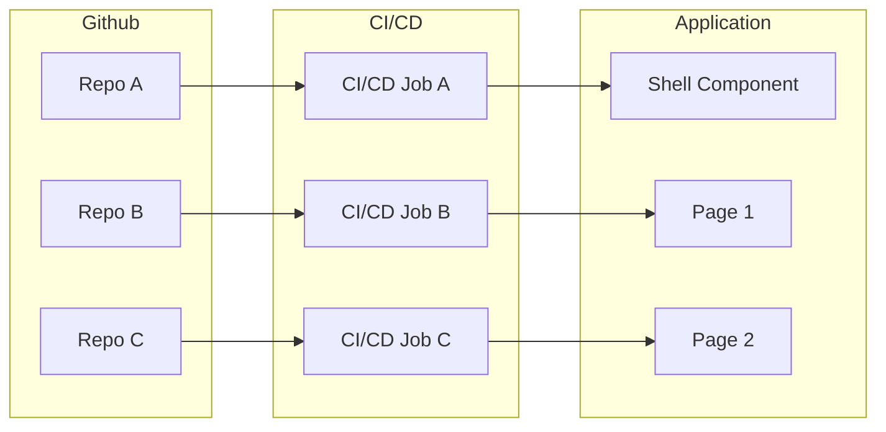

# Microfrontend Architecture

```mermaid
flowchart LR
    subgraph Application
        ca[Shell Component]
        cb[Page 1]
        cc[Page 2]
    end
    subgraph CI/CD
    jA[CI/CD Job A] --> ca
    jB[CI/CD Job B] --> cb
    jC[CI/CD Job C] --> cc
    end
    subgraph Github 
        A[Repo A] --> jA
        B[Repo B] --> jB
        C[Repo C] --> jC
    end
```